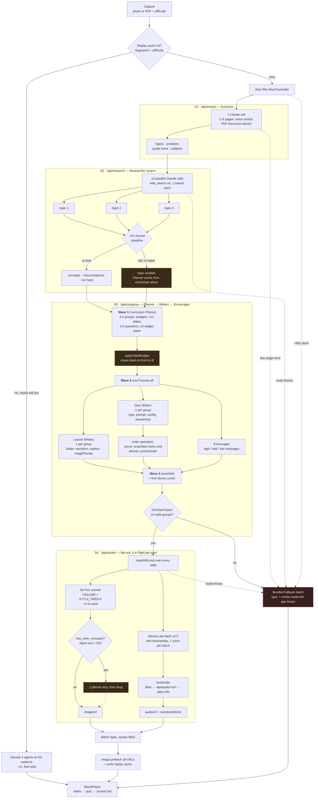

# Zing — Content Generation Pipeline

Diagrams for the four-stage swarm described in [ARCH.md](ARCH.md) §2. The app is
the orchestrator: it calls each stage over HTTPS in sequence, passes outputs
forward, narrates progress, and enforces one 90s deadline over the whole run
(`PIPELINE_DEADLINE_MS`, `mobile/src/lib/api.ts`).

---

## 1. Flow chart

**Reading the dashed edges:** every one of them is a *degrade*, not a crash. The
design rule across all four stages is that a duller batch beats no batch — a
dropped research topic, a trimmed slide, a blanked image and a missing clip all
ship, and only "fewer than 3 valid questions" or the 90s cap sends the child to
the bundled fallback.

---

## 2. Sequence diagram

```mermaid
sequenceDiagram
    autonumber
    actor Kid
    participant App as Expo app<br/>orchestrator
    participant EX as /api/extract
    participant RE as /api/research
    participant CO as /api/compose
    participant AS as /api/assets
    participant CL as Anthropic<br/>Claude
    participant FAL as fal.ai<br/>Flux schnell
    participant EL as ElevenLabs<br/>flash v2.5
    participant BL as Vercel Blob

    Kid->>App: photo of worksheet + difficulty
    App->>App: fingerprint bytes, check replay cache
    Note over App: miss → start 90s AbortController

    rect rgb(28,38,52)
    Note over App,CL: S1 · Extractor — ~8s
    App->>EX: POST {image|pdf, difficulty}
    EX->>CL: 1 call, vision / document block
    CL-->>EX: subjects, topics, problems, gradeBand
    EX-->>App: {extraction}
    end

    rect rgb(28,44,38)
    Note over App,CL: S2 · Researcher swarm — ~14s hard cap
    App->>RE: POST {extraction, difficulty}
    par topic 1
        RE->>CL: web_search, maxSearches 1
        CL-->>RE: concepts, misconceptions, facts
    and topic 2
        RE->>CL: web_search, maxSearches 1
        CL-->>RE: concepts, misconceptions, facts
    and topic 3
        RE->>CL: web_search, maxSearches 1
        CL--xRE: still in flight at 14s → dropped
    end
    RE-->>App: {research: topics that made it}
    end

    rect rgb(42,34,52)
    Note over App,CL: S3 · Planner → Writers → Encourager — ~12s
    App->>CO: POST {extraction, research, difficulty}
    CO->>CL: Planner (sequential — the only blocking call)
    CL-->>CO: 3–5 groups within hard budgets
    CO->>CO: applySlideBudget
    par per group
        CO->>CL: Lesson Writer
        CL-->>CO: slides {narration, caption, imagePrompt}
    and per group
        CO->>CL: Quiz Writer
        CL-->>CO: question {type, config, answerKey}
    and once
        CO->>CL: Encourager
        CL-->>CO: high / mid / low messages
    end
    CO->>CO: scramble `order` items, derive correctOrder
    CO->>CO: Zod-validate BatchSpec, drop broken groups
    alt ≥3 valid groups
        CO-->>App: {batch} — text complete, no media
    else fewer
        CO--xApp: 502 → bundled fallback
    end
    end

    rect rgb(52,38,28)
    Note over App,BL: S4 · Illustrator ‖ Narrator — ~10–15s, 4 in flight per pool
    App->>AS: POST {batch}
    AS->>AS: pickVoiceId() once for the whole batch
    par image pool
        loop each slide, ≤4 concurrent
            AS->>FAL: STYLE_PREFIX + imagePrompt, 720×1280
            FAL-->>AS: url — or black rect + has_nsfw_concepts → 1 retry
        end
    and audio pool
        loop each slide, ≤4 concurrent
            AS->>EL: narration → /with-timestamps
            EL-->>AS: base64 mp3 + char alignment
            AS->>AS: fold chars into narrationWords
            AS->>BL: upload mp3
            BL-->>AS: public URL
        end
    end
    AS-->>App: {batch} with imageUrl / audioUrl / narrationWords
    end

    App->>App: Image.prefetch all slides, write replay cache
    App-->>Kid: "Your batch is ready" → tap to start
    Kid->>App: tap
    Note over App,Kid: slides auto-advance on clip end,<br/>karaoke lights each word, quiz pauses audio
```

---

## 3. Budget at a glance

| Stage | Route | Calls | Budget | Degrade |
|---|---|---|---|---|
| S1 Extractor | `/api/extract` | 1 Claude (vision) | ~8s | none — a failure is fallback |
| S2 Researcher | `/api/research` | ≤3 Claude, parallel, `web_search` | ~14s hard | topic dropped, plan from worksheet |
| S3 Compose | `/api/compose` | 1 + (2 × groups) + 1 Claude | ~12s | trim slides, drop groups, <3 → fallback |
| S4 Assets | `/api/assets` | 2N provider calls, 4 in flight each | ~10–15s | caption-over-gradient · silent slide |
| **Total** | | | **<45s** (90s cap) | bundled fallback batch |
